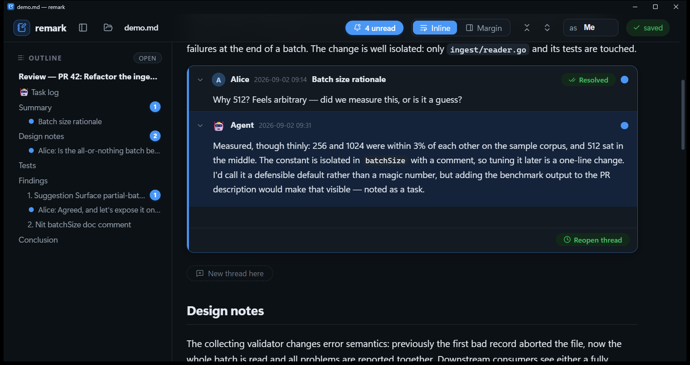

#  remark

**A discussion tool built on top of markdown.** remark renders a markdown
document and lets people — and AI agents — hold threaded discussions inside
it: comments, replies and read-markers are plain checkbox list items stored in
the file itself, so the document and the conversation about it live in one
portable, diffable `.md` file. Use it to review an agent's work, co-edit a
living document, or keep a structured conversation anchored to the text it is
about.



## Why

Working with an AI on anything substantial has a familiar failure mode: the
discussion outgrows the chat.

- You raise three points, the agent comes back with five, and you lose
  track of which ones you've answered.
- You return to an earlier point and the agent guesses wrong about what
  you're replying to — there's no way to point precisely at a moment in the
  discussion.
- Anything you say while the agent is working arrives late and out of
  context — so you interrupt it, or wait.
- The chat grows into a wall of text: huge, unorganized, useless for
  looking up what was decided and why.
- Requests pile up, and nothing tells you which ones were actually
  resolved. Long linear chats are simply overwhelming.
- Comments about a document live in the chat, nowhere near the text they're
  about.
- The obvious fix — both of you editing one markdown file — ends in edit
  conflicts, because editors aren't designed for concurrent edits by agents
  and programs.

remark moves the discussion into the document: every point is a **thread
anchored to the text it's about**, with author-owned **resolution**,
per-reader **read-marks**, and **conflict-free concurrent writing**. A
thought added mid-work isn't a queued chat message — it's a comment sitting
in exact context, waiting where the agent will look.

The other side (an agent, a teammate, a script) can keep writing to the file
while you have unsent drafts open: remark keeps comment state in memory,
watches the file in realtime, and saves via compare-and-swap with automatic
retry, so nobody's edits are ever lost. No git involved — the file can be an
uncommitted scratch file inside a repo.

## The markdown convention

Threads are ordinary list items, so the file stays readable everywhere:

```markdown
Some paragraph of the document being discussed.

- [ ] Alice (2026-09-02 14:32): I don't agree with this part. <!--thread-->

  - 🤖 Agent (2026-09-02 14:40): Fair — here's why I wrote it that way… <!--seen:Alice-->
```

- A **top-level** authored item is a thread root; **indented** items under it
  are replies (arbitrary nesting supported, flat threads encouraged). A
  nested plain item counts as a reply only when it carries a *timestamped*
  author prefix — ordinary list bullets inside a comment body (even
  `Word: text` ones) stay body content, so bodies may freely contain lists.
- A **checkbox** on a comment is its **resolution**, settled by its author:
  `- [ ]` opens something that needs an answer (thread roots usually do),
  `- [x]` means its author considers it settled. **Plain `- ` replies carry
  no status** — most conversation needs none. Opening a resolvable subthread
  is a deliberate act (a "needs resolution" toggle in the composer, or just
  typing the brackets). Unattributed checkbox items inside a comment are its
  own resolvable checklist.
- **Read state is per reader, per message**, stored as a hidden
  `<!--seen:Name1,Name2-->` marker on the comment's first line, and it moves
  only when a reader deliberately marks it (a toggleable dot in the app —
  filled = unread, a green ✓ = read). Nothing is marked automatically;
  noticing a message is not "done".
- The author prefix may carry a plain-text timestamp — `Author (YYYY-MM-DD
  HH:mm):` — which remark writes on every comment it creates and renders as a
  dim time next to the author. Comments without one are fine too. A writer
  that doesn't know the time writes `Author (now):` — the line is a comment
  at once, and a remark window on the file (or `remark stamp <file>`) swaps
  `(now)` for the real, unique stamp.
- A thread gets a **title** when the root comment's body starts with a line
  that is entirely bold: `- [ ] Alice: **Batch size rationale**` followed by
  the comment text on the next line. The title is shown in the card header
  and as the collapsed summary.
- A reply can also be an **interjection**: placed half-way through another
  comment (between its paragraphs), where the renderer keeps it. In the app,
  hover between paragraphs for the "— insert comment —" seam.
- **Identity convention**: agents self-identify, humans don't have to. Any
  hand-typed comment without an author is presumed to be the local user —
  a running remark window stamps it with the profile name and the time once
  the file settles — while agents (there may be several on one file) always
  write with an explicit `Author (timestamp):` prefix.
- Thread roots written by remark carry an invisible `<!--thread-->` marker
  (legacy `<!--rv-->` is also accepted) so inline threads are unambiguously
  distinguishable from ordinary task lists (an agent's task log at the top of
  the file is rendered as plain markdown and left alone). Replies never need
  a marker — nesting under a thread root is what makes them replies. For
  unmarked files a heuristic also recognises `- Name: …` / `- [ ] 🤖 Name: …`
  items as threads.
- **v1 compatibility**: files from before the resolution model (where every
  comment was a checkbox item and a tick meant "read") still parse; an old
  tick counts as read.

## Usage

```
remark.exe path\to\review.md          # opens in its own window (WebView2)
remark.exe -browser file.md           # use the default browser instead
remark.exe -serve -port 7333 file.md  # headless server only
remark.exe install                    # copy to a per-user dir + add to PATH
```

Run it with no argument to get a landing page with a native file picker and
recent files. Try it on the bundled sample: `remark.exe examples\demo.md`.

### For agents: `remark --help` and `remark monitor`

`remark --help` prints the full convention above in agent-digestible form —
telling an agent "let's discuss this in doc.md, run `remark --help` to learn
the format" is enough for it to participate correctly.

```
remark monitor <files-or-globs...> [-as name] [-json] [-interval 300ms]
                                   [-thread sel[,sel...]] [-mine]
```

`-as` is the agent's own author name: its writes are excluded from the
event stream, and the monitor drops a pid-file style presence record so any
remark window on a file in its scope shows the agent as **online** in the
"Who's here" panel (above the outline, next to the local profile and every
author in the document). Liveness is the pid itself — no heartbeat, no
server needed, and a crashed agent reads as offline immediately.
(`-ignore-author name,name` still works as a filter-only flag.)

**Thread scope** — for many agents on one file, say an orchestrator's
`TODO.md` where each worker owns a thread: `-thread <selector>` limits the
stream to threads whose root matches a `remark read` selector (a timestamp,
or the title verbatim; repeatable or comma-separated), and `-mine` limits
it to threads the agent took part in — a comment signed with its name, or
one that **tags** it. Tagging is `@Name` in the comment text (the composer
pops up a picker of authors on `@`, inserting the name exactly as signed);
a tag always reaches its target whatever the scope, and enrolls the agent
in that thread under `-mine`. Every `-json` event carries `root`, the
thread root's timestamp, so `remark read <file> <root>` prints the thread
the event belongs to.

A headless watcher built for AI agents (a Claude hook, a `Monitor` command, a
script): it emits one line per **new comment** and per **read-checkbox
toggle** — with author, timestamp, section, thread and the comment text — and
stays silent about everything else. `-ignore-author claude` filters out the
agent's own writes. Names match LITERALLY — byte for byte, no case
folding, no emoji stripping — so pass exactly the string you sign with
(`-as "🤖 Claude"` for comments signed `🤖 Claude`),
so the agent only wakes up for what the human did, and usually doesn't need
to re-read the file at all. `-json` switches to NDJSON. Run it again
with another file to get a second window — one window per file, each instance
picks the next free port. Author name, view mode, recents and unsent drafts
are shared across all windows (stored in `%APPDATA%\remark\prefs.json` /
`~/.config/remark/prefs.json`).

The UI follows the system light/dark theme automatically and uses the system
UI font (Segoe UI Variable on Windows).

- **Inline / Margin** — comments in the document flow (collapsible per
  thread, ⊟/⊞ collapse all), or Word-style review cards in a right margin
  aligned to the paragraph they belong to.
- **💬 on hover** over any paragraph starts a new thread there; **↩ reply**
  on any comment nests a reply. Markdown allowed; Ctrl+Enter sends.
- **"as \[name\]"** in the toolbar sets the author your comments are signed with.
- The unread pill jumps through unread comments; new agent comments flash in
  live as the file changes on disk.

## How conflicts are handled

Your unsent drafts live in memory (and localStorage) — external file changes
just re-render the document under them. Sending a comment creates an
*operation* anchored by content (which paragraph / which parent comment), not
by line number. Saving is a compare-and-swap: if the file changed underneath,
remark re-reads it, re-applies your operations to the fresh content and
retries. If the anchor itself was deleted from the file, the comment is never
dropped — it lands in a tray where you can copy it, append it at the end, or
discard it.

## Building

Pure Go, no C toolchain needed:

```
go build -ldflags "-H windowsgui -s -w" -o remark.exe .          # Windows
GOOS=linux  go build -s -o remark-linux .                        # Linux
GOOS=darwin GOARCH=arm64 go build -o remark-macos .              # macOS
```

`rsrc_windows_amd64.syso` embeds the app icon (`assets/icon.ico`) and the
manifest (`assets/app.manifest`, which declares Per-Monitor-V2 DPI awareness —
without it the window renders blurry on scaled displays). It is picked up by
`go build` automatically; regenerate it after changing either asset with:

```
go install github.com/akavel/rsrc@latest
rsrc -manifest assets/app.manifest -ico assets/icon.ico -o rsrc_windows_amd64.syso
```

On Windows the window is a native WebView2 (ships with Windows 11). On
macOS/Linux the same binary opens a chromium `--app=` window when a
chromium-family browser is installed, and falls back to the default browser
otherwise.

License: [MIT](LICENSE).

Layout: `main.go` / `server.go` (CAS file API + SSE watcher), `ui/` (embedded
frontend; `ui/parser.js` holds the thread parser + operation applier and is
directly testable in Node). Icons: [Lucide](https://lucide.dev) (ISC), embedded
in `ui/icons.js`. Note the UI is embedded via `go:embed` — rebuild after
editing anything under `ui/`.
